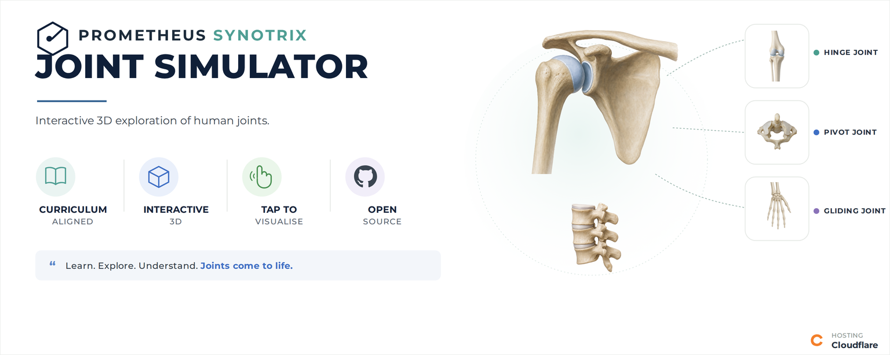

  

# 🦿 Prometheus Synotrix

### *Interactive Human Joint Simulator*

> **Prometheus Synotrix** is an interactive visualization exploring **human joint structure, classification, and movement** through simplified 3D anatomical models.
>
🦿 **Human Anatomy** · 🔄 **Joint Movement** · 🩻 **Skeletal System**

**🔬 [Explore the Simulation](YOUR-LINK-HERE)**

---

## ✦ Features

**🦿 Interactive 3D Models**  
Rotate, zoom, and explore simplified anatomical models of human joints.

**🔄 Joint Movement Simulation**  
Visualize movement associated with different joint types.

**🔍 Inspect Mode**  
Explore anatomical structures through interactive labels and visual identification.

**📚 NCERT Aligned**  
Supports school-level Biology concepts related to the skeletal system and joints.

**🧠 Educational Visualization**  
Explore joint anatomy through simplified models designed for conceptual learning.

**📱 Responsive Design**  
Optimized for modern desktop and mobile devices.

---

## 🦿 Joint Types

**Ball-and-Socket · Hinge · Pivot · Cartilaginous · Synovial · Fibrous**

---

## ⚙️ Technology

**HTML · CSS · JavaScript**

**Repository:** GitHub & Codeberg  
**Hosting:** GitHub Pages

---

## ⚠️ Educational Disclaimer

The anatomical models and movement visualizations are **simplified representations intended for educational and conceptual purposes**. They are not intended to serve as medical, diagnostic, or anatomically exact references.

---

## 📜 License

Distributed under the **GNU General Public License v3.0 (GPL-3.0)**.
